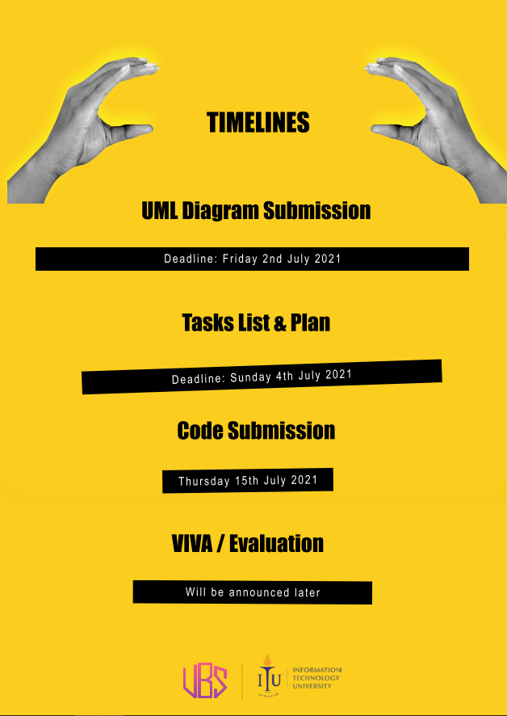

## PROJECT

### Implement the Project According to the specification given on google classroom.

## Make the following folders
### 1. UML
### 2. Task List
### 3. Code

### Make sure you make submissions in respected folders.

### Additional Functions

Each class should have its own .h and .cpp file. 

### Run command

`make run`  This will run main.cpp executable 

### Notes

- `g++` can be used to compile and link C++ applications for use with existing test harnesses or other C++ testing frameworks.
- You should use C++ standard approach for the development, using g++ extensions is not acceptable 

